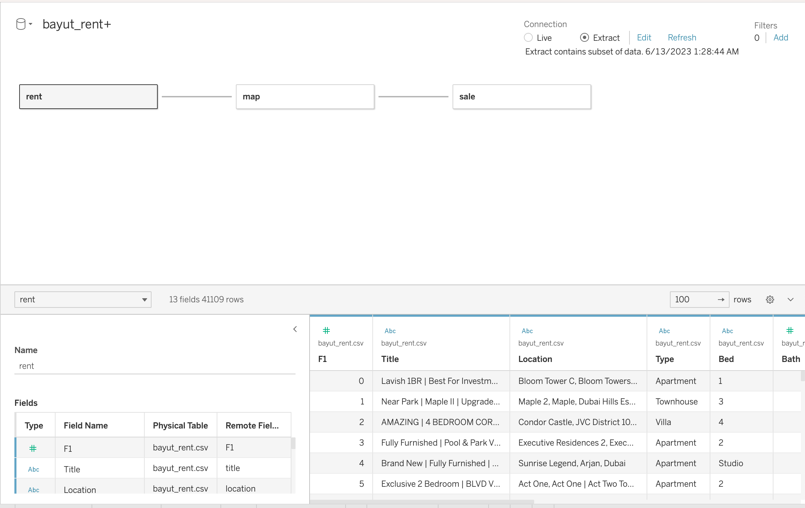
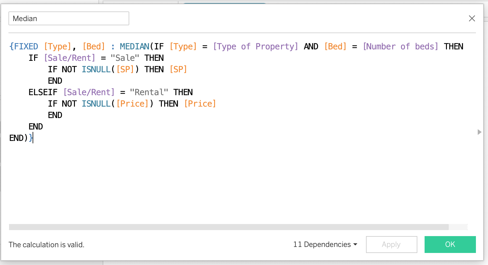
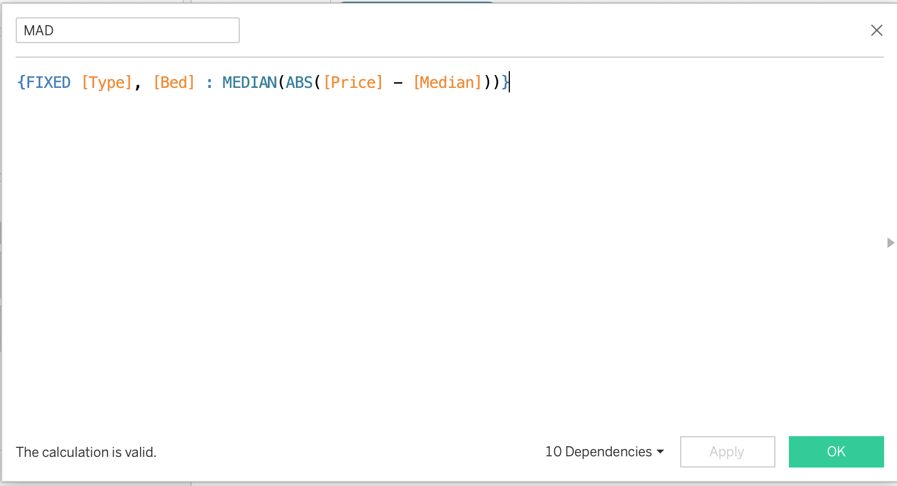
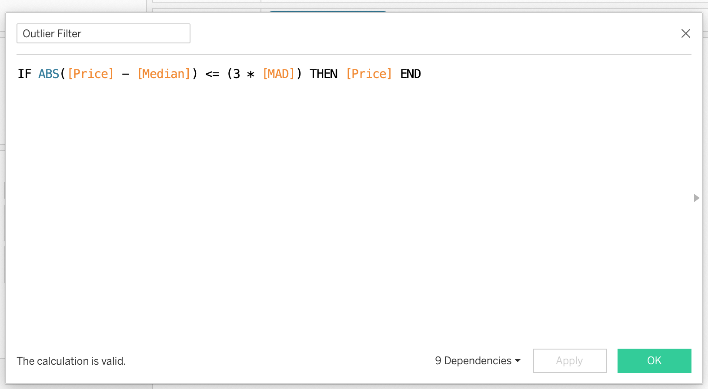
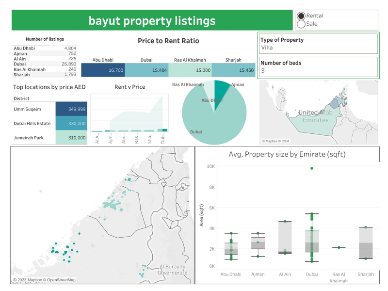

# Real Estate Data Analytics

## Table of Contents
- [Abstract](#abstract)
- [Introduction](#introduction)
- [Context](#context)
- [Purpose](#purpose)
- [Description](#description)
- [Hypothesis](#hypothesis)
- [Methods](#methods)
- [Analysis](#analysis)
- [Conclusion](#conclusion)

## Abstract
The aim of this project is to provide insights into the residential property market through the analysis of rental and sale property data. By leveraging web scraping techniques to collect data from the www.bayut.com website, we will acquire information on key attributes such as property type, location, features – size, number of beds and baths, and price. The collected data will be cleaned, transformed, and analyzed using data science techniques, with the goal of providing valuable information to individuals seeking to make informed decisions regarding property investment or rental choices. The project will utilize visualization tool - Tableau, to present the findings in an interactive and informative manner.

## Introduction
The real estate market plays a significant role in the lives of individuals, as it involves important financial decisions related to buying or renting properties. Understanding the market dynamics, price trends, and factors influencing property prices is crucial for making informed decisions. This project aims to provide a comprehensive analysis of the residential property market, enabling individuals to gain insights into property prices, location preferences, and the price-to-rent ratio.

## Context
Making decisions about buying or renting a property can be challenging due to various factors such as market conditions, location preferences, and financial considerations. Analyzing property data and understanding market trends can help individuals assess whether it is financially viable to buy or rent a property. By providing insights into price trends, location analysis, and the price-to-rent ratio, this project aims to assist individuals in making informed decisions about property investment or rental choices.

## Purpose
The main objectives of this project are as follows:

+ Analyze property prices to identify trends and patterns in the residential real estate market.
+ Evaluate the price-to-rent ratio as an indicator of the financial viability of buying or renting a property.
+ Investigate the key factors influencing property prices, such as location, property type, and number of beds and baths.
+ Provide actionable insights and visualizations to help individuals make informed decisions about property investment or rental choices.

## Description
In this project, we will collect data from www.bayut.com, a popular property listing website. The key attributes to be collected include the title of the property, location, property type (e.g., apartment, villa, townhouse), number of beds and baths, and the listed price. The collected data will be cleaned, transformed, and prepared for analysis.

## Hypothesis
Based on preliminary observations, we hypothesize that certain factors such as location, property type, and number of beds and baths will have a significant impact on property prices. We expect to find variations in prices across different locations and property types. Additionally, we anticipate that the price-to-rent ratio will differ based on these factors.

## Methods
To acquire the property data, we will employ web scraping techniques using Python library BeautifulSoup. The scraped data will undergo a thorough cleaning process to handle missing values, inconsistencies, and outliers. We will then utilize the Google Maps API to obtain the geographical coordinates for each property's location, enabling spatial analysis and mapping in Tableau.

### Project Code
- [Webscrape](webscrape.py)

To perform web scraping and generate two tables—one for rental properties and another for sale properties—the Python libraries Requests and Beautiful Soup were employed. The web scraping process involved the following steps:

+ Importing the necessary libraries: The project commenced by importing the required libraries, including Requests and Beautiful Soup, to make HTTP requests and parse HTML content, respectively.

+ Sending HTTP requests: The property website, in this case, "www.bayut.com," was targeted by sending an HTTP request using the Requests library. The response from the website was received, which contained the HTML content of the page.

+ Parsing HTML content: Beautiful Soup was utilized to parse the HTML content and extract the relevant information, such as the title, location, type of property, number of beds, baths, and price. These attributes were extracted from the HTML elements using appropriate CSS selectors or XPath expressions.

+ Creating data structures: Lists or data frames were created to store the extracted information from each property listing. Each property's attributes were appended to the respective lists or added as rows to the data frame.

+ Saving the data as tables: The extracted data for rental properties and sale properties were organized into separate tables, with columns representing the attributes of interest. These tables were then saved as datasets for further analysis and visualization.

By following these steps, web scraping using Requests and Beautiful Soup facilitated the extraction and organization of property data from the website. The resulting tables provided a structured representation of the rental and sale properties, which could be utilized for analysis and dashboard creation.

### Project Code
- [GeoCode](geocoding.py)

To geocode the unique location attributes from the rental and sale property tables, the Google Maps Geocoding API was utilized in conjunction with Python. The geocoding process involved the following steps:

+ Importing the necessary Python libraries: The project started by importing the required libraries, such as requests, to make API calls, and pandas, to handle the data.

+ Extracting unique location attributes: The location attributes from both the rental and sale property tables were extracted to create a list of unique locations.

+ Sending API requests: A loop was implemented to send API requests for each unique location. The requests were constructed by appending the location to the API endpoint and including the API key for authentication.

+ Handling API responses: The API responses were received in JSON format, and the necessary information, such as latitude and longitude, was extracted from the response using Python's JSON parsing capabilities.

+ Creating a new table: The extracted location coordinates were organized into a new table with columns for the location and its corresponding latitude and longitude.

+ Saving the geocoded data: The newly created table was saved as a separate dataset for further analysis and visualization.

By following these steps, the geocoding process successfully transformed the location attributes into their respective coordinates. This enabled the creation of maps and spatial analyses using the latitude and longitude data.

## Analysis

The data will be analyzed using various data science techniques and visualization tools. We will explore the relationships between property attributes (location, type, beds, baths) and prices through visualizations. Furthermore, we will calculate the price-to-rent ratio for different locations and property types to evaluate the financial feasibility of buying or renting properties.
following details about the metrics used and the price-to-rent ratio:

+ Data Skewness and Outlier Handling: The collected property data may contain outliers, which can significantly skew the analysis and distort the insights gained. To address this issue, mean absolute deviation (MAD) and median were used to identify and filter out the outliers. This approach helps ensure that the remaining data represents a more accurate and representative picture of the property market.

+ When analyzing real estate prices, the median value is preferred over the average (mean) value due to its robustness to outliers. Real estate prices can be heavily influenced by extreme values or outliers, such as very high-end luxury properties or distressed properties sold at unusually low prices. These outliers can significantly impact the average value, pulling it towards their extremes. The median, on the other hand, is not as sensitive to outliers since it represents the middle value when the data is sorted. The median, being the middle value, is not influenced by the shape of the distribution and provides a more representative central tendency measure.

+ Price-to-Rent Ratio: The price-to-rent ratio is a metric commonly used to assess the financial viability of buying or renting a property. It is calculated by dividing the property sale price by the annual rental cost. In this project, the price-to-rent ratio was calculated for properties across different locations.

+ Significance of Price-to-Rent Ratio: The price-to-rent ratio serves as an important indicator for individuals considering whether to buy or rent a property. A lower price-to-rent ratio suggests that buying a property may be more financially advantageous compared to renting, while a higher ratio may indicate that renting is a more cost-effective option. However, it's important to note that the ideal price-to-rent ratio can vary depending on factors such as the local real estate market, economic conditions, and individual preferences.

+ Interpreting the Price-to-Rent Ratio: When analyzing the price-to-rent ratio, it's crucial to consider the local market context and establish a benchmark for what is considered a favorable ratio. Generally, a price-to-rent ratio between 15 and 20 is often seen as a reasonable range, indicating a balanced market. Ratios below 15 may suggest that buying is more advantageous, while ratios above 20 may lean towards renting being a more favorable option.

+ Interactive Dashboard: Through the use of calculated fields and parameters in Tableau, an interactive dashboard was created to present the price-to-rent ratio for properties by location. This interactive visualization allows users to explore the ratios and compare different locations, helping them make informed decisions based on their specific needs and preferences.

## Tableau Dashboard

## Conclusion
The analysis will provide valuable insights into the residential property market, including trends in property prices, the price-to-rent ratio, and the impact of various factors on property values. These insights can assist individuals in making informed decisions about
By leveraging these insights, you can make more informed decisions when it comes to buying, renting, or investing in properties.

## License
This project is licensed under the [MIT License](LICENSE).

